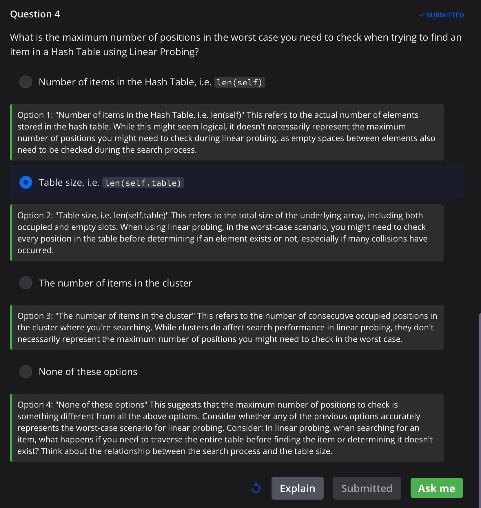
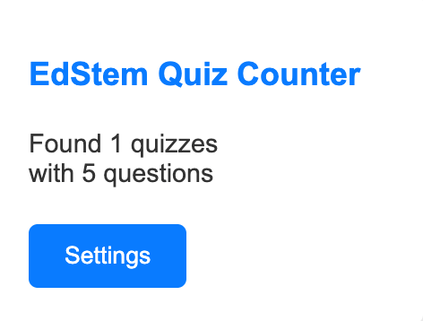

# EdStem Quiz Counter Chrome Extension

A Chrome Extension that helps students study on EdStem by counting quizzes and providing AI-powered explanations for quiz questions using Claude API.

## ⚠️ Academic Integrity Disclaimer

**IMPORTANT:** This extension is designed as a learning aid to help understand concepts, NOT to provide direct answers or enable cheating:

- The AI explanations focus on explaining concepts and reasoning, never providing direct answers
- Users are expected to follow their institution's academic integrity policies
- If you're unsure whether using this tool is permitted, please consult your instructor
- We strongly discourage any attempts to use this tool for academic dishonesty

## Features

- Counts the number of quizzes and questions on EdStem pages
- Provides AI-powered explanations for quiz options using Claude API
- Easy-to-use popup interface
- Configurable API settings

## Installation

1. Clone this repository or download the ZIP file
2. Open Chrome and go to `chrome://extensions/`
3. Enable "Developer mode" in the top right corner
4. Click "Load unpacked" and select the extension directory

## Setup

1. Get a Claude API key from Anthropic
2. Click the extension icon and go to "Settings"
3. Enter your Claude API key
4. Click "Save Settings"

## Usage

1. Visit any EdStem page with quizzes
2. Click the extension icon to see the quiz count
3. When viewing a quiz:
   - The extension will automatically detect quiz questions
   - Click the "Explain" button next to any question to get conceptual explanations
   - Note: The AI will explain concepts and reasoning, but will not provide direct answers

## How AI Explanations Work

- The AI provides conceptual explanations to help understand the topic
- Explanations focus on the "why" and "how" rather than specific answers
- Users are expected to form their own conclusions and answers
- The tool is meant to supplement learning, not replace it

## Example

## Files Structure

- `manifest.json` - Extension configuration
- `popup.html/js` - Extension popup interface
- `options.html/js` - Settings page
- `content.js` - Content script for EdStem page interaction
- `background.js` - Background service worker for API calls
- `styles.css` - Extension styling

## Permissions

- `activeTab` - To interact with the current tab
- `scripting` - To inject content scripts
- `storage` - To save settings
- Host permissions for edstem.org and api.anthropic.com

## Development

To modify the extension:
1. Make your changes to the source files
2. Reload the extension in `chrome://extensions/`
3. Test the changes on EdStem

## Notes

- The extension only works on EdStem pages
- Requires a valid Claude API key
- API responses are cached to minimize API calls
- Explanations are designed to help understanding, not provide direct answers

## Privacy

- API keys are stored locally in Chrome storage
- No data is collected or shared with third parties
- All API calls are made directly to Claude API

## Ethics and Usage Guidelines

- Use this tool responsibly as a learning aid
- Do not attempt to use it to circumvent academic integrity policies
- The AI is programmed to decline requests for direct answers
- Focus on understanding concepts rather than seeking quick solutions

## License

MIT License - feel free to modify and distribute as needed. 